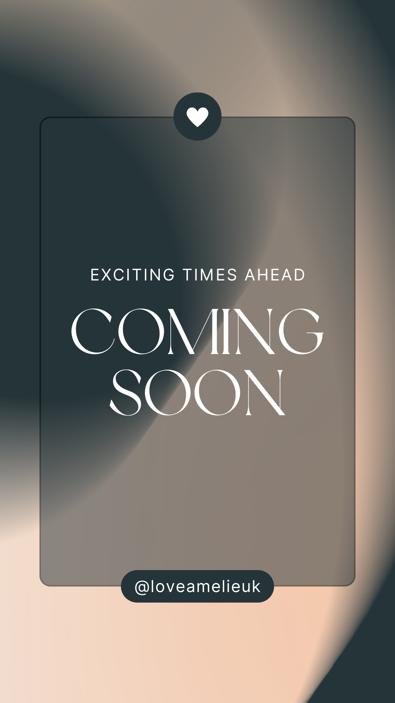
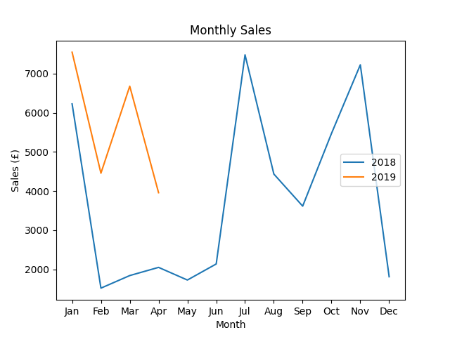

### Hey! Welcome to my portfolio 👋

- 🖥️ I'm currently working on ...
- 🌱 I'm currently learning ...
- 🤝 I'm looking to collaborate on ...
- ✨ I'm looking for help with ...
- 💬 Ask me about ...
- 📲 Contact me on ...
- ♀️ Pronouns are she/her

### My projects:

**Guess The Song - Musical Quiz Game**

*Software Engineering Nanodegree Final Project*

##### Click here ⤵️
            

- We applied agile methodology and KANBAN task organisation to collaboratively design an engaging musical quiz game. 
- It challenges players to identify popular songs, integrating with Spotify's API for up-to-date songs. - In each of the five rounds, players listen to a 10-second song clip, selecting the correct song title from four artist options for points. The game displays a highscore board upon completion. 
- To ensure quality, we conducted User Acceptance Testing (UAT) and implemented unit tests for Python logic. 
- Reliability was enhanced through integration, regression testing, and efficient code tracking on GitHub.
- 🏆 Certification Achieved - Distinction (96%)

**Love Amélie - Shop Database**

*Introduction to Data and SQL*

##### Click here ⤵️

**Spreadsheet Analysis - Shop**

Introduction to Python*

##### Click here ⤵️

